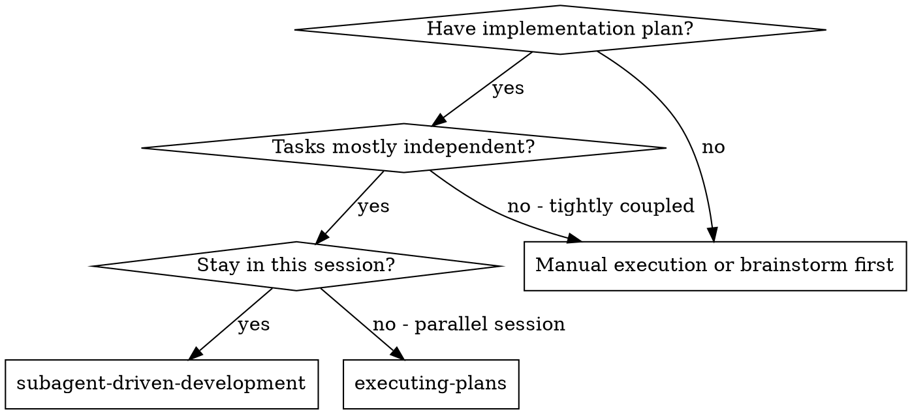
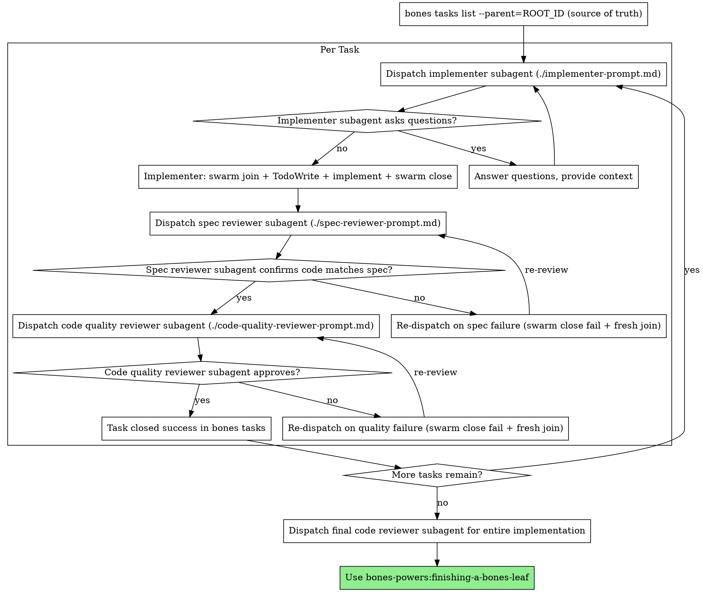

> **Execution mode**: this skill is for **parallel slot sessions** — multiple subagents claim and run plan steps concurrently, each in its own slot/leaf. For single-session inline runs, use `bones-powers:executing-plans` instead. (Per spec § 5 boundary.)

# Subagent-Driven Development

Execute plan by dispatching fresh subagent per task, with two-stage review after each: spec compliance review first, then code quality review. Each implementer runs in its own bones swarm session — isolated leaf, claimed task, dedicated worktree.

**Why subagents:** You delegate tasks to specialized agents with isolated context. By precisely crafting their instructions and context, you ensure they stay focused and succeed at their task. They should never inherit your session's context or history — you construct exactly what they need. This also preserves your own context for coordination work.

**Core principle:** Fresh subagent per task + bones swarm session (atomic claim) + two-stage review (spec then quality) = high quality, fast iteration

## When to Use



**vs. Executing Plans (parallel session):**
- Same session (no context switch)
- Fresh subagent per task (no context pollution)
- Two-stage review after each task: spec compliance first, then code quality
- Faster iteration (no human-in-loop between tasks)

## Coordinator Setup

```bash
ROOT_ID=<paste from writing-plans output>
bones tasks list --parent="$ROOT_ID" --json | jq '.[] | {id, title, slot, status}'
```

This is the source of truth. The coordinator does NOT mirror tasks into TodoWrite (per spec § 6). Tasks are claimed and closed atomically through the swarm session of each implementer subagent.

## The Process



## For Each Task: Implementer Dispatch

For each task in the bones task graph:

1. **Coordinator dispatches a fresh implementer subagent** with:
   - Task `id`, `slot`, full task title and body from `bones tasks show $TASK_ID`
   - The plan path (from `--files`)
   - Brief feedback context if this is a re-dispatch after review

2. **Implementer's first action** (per spec § 5.5):
   ```bash
   bones swarm join --slot="$SLOT" --task-id="$TASK_ID"
   ```
   This atomically: opens a leaf, claims the task, prepares a worktree.

3. **Implementer's second action**: TodoWrite a fresh checklist of the in-task micro-steps (per hybrid task model § 6).

4. **Implementer does the work**, heartbeating via `bones swarm commit -m '…'`.

5. **Implementer closes the swarm session**:
   ```bash
   bones swarm close --result=success --summary='<one-line result>'
   ```

## Re-dispatch on Review Issues

If the spec-compliance reviewer or code-quality reviewer reports issues:

1. **Implementer closes the swarm session as failed**:
   ```bash
   bones swarm close --result=fail --summary='<feedback summary>'
   ```
   This releases the claim. The task returns to the pending pool with the failure summary attached to its thread.

2. **Coordinator dispatches a fresh implementer** with the original task + the review feedback as additional context.

3. **New implementer joins via `bones swarm join`** (re-claims the same task), addresses the feedback, and re-runs the review loops.

This loop continues until both reviews pass.

## Reviewer Dispatch

Spec-compliance and code-quality reviewers are read-only — they inspect the implementer's leaf directly without claiming a slot of their own. Dispatch them as fresh subagents with:
- The task text
- The implementer's report
- The path to the implementer's worktree (from `bones swarm cwd --slot=$SLOT`)

If a reviewer needs write access (e.g., to annotate or commit a finding), open a sibling slot session (e.g., `--slot=spec-review`, `--slot=code-review`) via a separate `bones swarm join`.

## Model Selection

Use the least powerful model that can handle each role to conserve cost and increase speed.

**Mechanical implementation tasks** (isolated functions, clear specs, 1-2 files): use a fast, cheap model. Most implementation tasks are mechanical when the plan is well-specified.

**Integration and judgment tasks** (multi-file coordination, pattern matching, debugging): use a standard model.

**Architecture, design, and review tasks**: use the most capable available model.

**Task complexity signals:**
- Touches 1-2 files with a complete spec → cheap model
- Touches multiple files with integration concerns → standard model
- Requires design judgment or broad codebase understanding → most capable model

## Handling Implementer Status

Implementer subagents report one of four statuses. Handle each appropriately:

**DONE:** Proceed to spec compliance review.

**DONE_WITH_CONCERNS:** The implementer completed the work but flagged doubts. Read the concerns before proceeding. If the concerns are about correctness or scope, address them before review. If they're observations (e.g., "this file is getting large"), note them and proceed to review.

**NEEDS_CONTEXT:** The implementer needs information that wasn't provided. Provide the missing context and re-dispatch.

**BLOCKED:** The implementer cannot complete the task. Assess the blocker:
1. If it's a context problem, provide more context and re-dispatch with the same model
2. If the task requires more reasoning, re-dispatch with a more capable model
3. If the task is too large, break it into smaller pieces
4. If the plan itself is wrong, escalate to the human

**Never** ignore an escalation or force the same model to retry without changes. If the implementer said it's stuck, something needs to change.

## Prompt Templates

- `./implementer-prompt.md` - Dispatch implementer subagent
- `./spec-reviewer-prompt.md` - Dispatch spec compliance reviewer subagent
- `./code-quality-reviewer-prompt.md` - Dispatch code quality reviewer subagent

## Example Workflow

```
You: I'm using Subagent-Driven Development to execute this plan.

[bones tasks list --parent=ROOT_ID]
→ [T1: Hook installation script | slot=alpha | status=pending]
→ [T2: Recovery modes | slot=beta | status=pending]
...

Task 1: Hook installation script

[bones tasks show T1_ID → full task text]
[Dispatch implementation subagent with task text + context]
  Implementer first: bones swarm join --slot=alpha --task-id=T1_ID
  Implementer second: TodoWrite [setup, tests, commit, self-review]

Implementer: "Before I begin - should the hook be installed at user or system level?"

You: "User level (~/.config/bones-powers/hooks/)"

Implementer: "Got it. Implementing now..."
[Later] Implementer:
  - Implemented install-hook command
  - Added tests, 5/5 passing
  - Self-review: Found I missed --force flag, added it
  - bones swarm close --result=success --summary='install-hook with --force, 5/5 tests'

[Dispatch spec compliance reviewer with implementer's worktree path]
Spec reviewer: ✅ Spec compliant - all requirements met, nothing extra

[bones tasks show T1_ID — confirms closed:success]

Task 2: Recovery modes

[bones tasks show T2_ID → full task text]
[Dispatch implementation subagent with task text + context]
  Implementer first: bones swarm join --slot=beta --task-id=T2_ID
  Implementer second: TodoWrite [verify mode, repair mode, tests, commit]

Implementer: [No questions, proceeds]
Implementer:
  - Added verify/repair modes
  - 8/8 tests passing
  - Self-review: All good
  - bones swarm close --result=success --summary='verify+repair modes, 8/8 tests'

[Dispatch spec compliance reviewer]
Spec reviewer: ❌ Issues:
  - Missing: Progress reporting (spec says "report every 100 items")
  - Extra: Added --json flag (not requested)

[Coordinator dispatches fresh implementer with original task + review feedback]
  New implementer: bones swarm close --result=fail --summary='missing progress reporting, extra --json flag'
  New implementer: bones swarm join --slot=beta --task-id=T2_ID  (re-claim)
  New implementer: TodoWrite [remove --json, add progress reporting, re-test]

[Implementer fixes issues]
Implementer: Removed --json flag, added progress reporting
  bones swarm close --result=success --summary='progress reporting added, --json removed'

[Spec reviewer reviews again]
Spec reviewer: ✅ Spec compliant now

[Dispatch code quality reviewer]
Code reviewer: Strengths: Solid. Issues (Important): Magic number (100)

[Re-dispatch implementer with quality feedback]
  bones swarm close --result=fail --summary='magic number 100 needs PROGRESS_INTERVAL constant'
  bones swarm join --slot=beta --task-id=T2_ID
  Implementer: Extracted PROGRESS_INTERVAL constant
  bones swarm close --result=success --summary='PROGRESS_INTERVAL constant extracted'

[Code reviewer reviews again]
Code reviewer: ✅ Approved

...

[After all tasks]
[Dispatch final code-reviewer]
Final reviewer: All requirements met, ready to merge

Done!
```

## Advantages

**vs. Manual execution:**
- Subagents follow TDD naturally
- Fresh context per task (no confusion)
- Parallel-safe (subagents each hold their own slot)
- Subagent can ask questions (before AND during work)

**vs. Executing Plans:**
- Same session (no handoff)
- Continuous progress (no waiting)
- Review checkpoints automatic

**Efficiency gains:**
- Coordinator queries bones tasks list (no file reading overhead)
- Controller curates exactly what context is needed via `bones tasks show`
- Subagent gets complete information upfront
- Questions surfaced before work begins (not after)
- Atomic claim via `bones swarm join` prevents double-work

**Quality gates:**
- Self-review catches issues before handoff
- Two-stage review: spec compliance, then code quality
- Review loops ensure fixes actually work
- Spec compliance prevents over/under-building
- Code quality ensures implementation is well-built

**Cost:**
- More subagent invocations (implementer + 2 reviewers per task)
- Controller does more prep work (querying bones task graph)
- Review loops add iterations
- But catches issues early (cheaper than debugging later)

## Red Flags

**Never:**
- Start implementation on main/master branch without explicit user consent
- Skip reviews (spec compliance OR code quality)
- Proceed with unfixed issues
- Dispatch multiple implementation subagents for the same slot (conflicts)
- Make subagent read plan file (provide full text via `bones tasks show` instead)
- Skip scene-setting context (subagent needs to understand where task fits)
- Ignore subagent questions (answer before letting them proceed)
- Accept "close enough" on spec compliance (spec reviewer found issues = not done)
- Skip review loops (reviewer found issues = implementer closes fail + fresh join = review again)
- Let implementer self-review replace actual review (both are needed)
- **Start code quality review before spec compliance is ✅** (wrong order)
- Move to next task while either review has open issues
- **Mirror bones tasks into TodoWrite at coordinator level** (source of truth is bones tasks, not TodoWrite)

**If subagent asks questions:**
- Answer clearly and completely
- Provide additional context if needed
- Don't rush them into implementation

**If reviewer finds issues:**
- Implementer closes swarm session as failed (`bones swarm close --result=fail`)
- Coordinator dispatches fresh implementer with feedback
- New implementer re-joins via `bones swarm join`
- Reviewer reviews again
- Repeat until approved
- Don't skip the re-review

**If subagent fails task:**
- Dispatch fix subagent with specific instructions
- Don't try to fix manually (context pollution)

## Integration

**Required workflow skills:**
- **bones-powers:using-bones-swarm** - REQUIRED: understand slot sessions before starting
- **bones-powers:writing-plans** - Creates the plan this skill executes
- **bones-powers:requesting-code-review** - Code review template for reviewer subagents
- **bones-powers:finishing-a-bones-leaf** - Complete development after all tasks

**Subagents should use:**
- **bones-powers:test-driven-development** - Subagents follow TDD for each task

**Alternative workflow:**
- **bones-powers:executing-plans** - Use for single-session inline execution instead of parallel slot sessions
