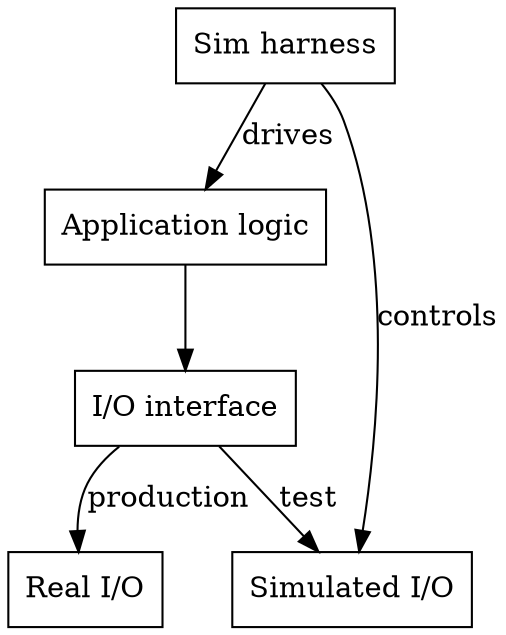

# Deterministic Simulation Testing (DST)

## Overview

DST collapses a multi-node distributed system into a **single-threaded simulation** where all non-determinism (network, disk, time, randomness) is controlled by a **seeded PRNG**. Same seed = same execution = perfect reproducibility.

Origin: FoundationDB — "We found all of the bugs in the database." Adopted by TigerBeetle, RisingWave, Dropbox, WarpStream, and others.

## When to Use

- Building distributed systems, consensus protocols, sync engines, replicated state
- Code with network I/O, disk I/O, timers, or concurrency
- Flaky tests caused by race conditions or timing
- Need to find bugs that only manifest under rare failure combinations
- Want reproducible failure cases from randomized testing

**When NOT to use:**
- Pure computational code with no I/O or concurrency
- Simple CRUD apps without distributed state
- Performance benchmarking (simulation doesn't measure real performance)

## The Three Pillars

### 1. I/O Abstraction

Every interaction with the outside world goes through an interface that can be swapped for simulation.

```
┌─────────────────────────────┐
│       Application Logic     │
├─────────────────────────────┤
│       I/O Interface Layer   │
├──────────┬──────────────────┤
│ Real I/O │ Simulated I/O    │
│ (prod)   │ (test)           │
└──────────┴──────────────────┘
```

**What to abstract:** Network (TCP/UDP/RPC), Disk (reads/writes/fsync), Time (clocks/timers/sleep), Random (all PRNG sources).

**Go example:**

```go
// Interface that both real and simulated implementations satisfy.
type Network interface {
    Send(to NodeID, msg []byte) error
    Recv() (from NodeID, msg []byte, err error)
}

type Clock interface {
    Now() time.Time
    Sleep(d time.Duration)
    After(d time.Duration) <-chan time.Time
}

type Storage interface {
    Write(key string, data []byte) error
    Read(key string) ([]byte, error)
    Sync() error
}
```

### 2. Single-Threaded Deterministic Execution

All "concurrent" nodes run cooperatively in one thread. A scheduler decides which node runs next, controlled by the seed.

**State machine pattern (from sled):**

```
fn receive(msg, at) -> [(msg, destination)]  // Handle incoming message
fn tick(at) -> [(msg, destination)]           // Advance time step
```

**Simulation loop:**

```go
type Simulator struct {
    rng     *rand.Rand       // Seeded PRNG — the ONLY source of randomness
    clock   *SimClock        // Virtual time
    network *SimNetwork      // In-memory message queues with fault injection
    storage *SimStorage      // In-memory disk with crash/corruption injection
    events  *PriorityQueue   // Ordered by virtual timestamp
    nodes   map[NodeID]*Node // All nodes in the simulation
}

func (s *Simulator) Run(seed int64, steps int) {
    s.rng = rand.New(rand.NewSource(seed))

    for i := 0; i < steps; i++ {
        event := s.events.Pop()
        s.clock.AdvanceTo(event.Time)

        // Deliver event to target node.
        responses := event.Node.Handle(event.Msg)

        for _, resp := range responses {
            // Network simulation: delay, reorder, drop.
            if s.shouldDeliver() {
                delay := s.randomDelay()
                s.events.Push(Event{
                    Time: s.clock.Now().Add(delay),
                    Node: resp.To,
                    Msg:  resp.Msg,
                })
            }
        }

        s.checkInvariants()
    }
}
```

### 3. BUGGIFY — White-Box Fault Injection

Black-box fault injection (network partitions, crashes) can't trigger higher-level distributed failures. BUGGIFY injects faults *inside your own code* to exercise rare paths.

**Three rules:**
1. **Simulation-only** — never fires in production
2. **Deterministic per-run** — each BUGGIFY site is enabled/disabled for the entire run (decided by seed)
3. **Default 25% probability** — customizable per site

**Go implementation:**

```go
var simulationMode bool // Set by test harness, never in production.

// Buggify returns true with the given probability, but ONLY in simulation.
func Buggify(probability float64) bool {
    if !simulationMode {
        return false
    }
    return globalRng.Float64() < probability
}

// Usage in application code:
func (r *Replica) sendHeartbeat() error {
    if Buggify(0.1) {
        // 10% chance: delay heartbeat to test election timeout.
        simClock.Sleep(electionTimeout * 2)
    }
    if Buggify(0.05) {
        // 5% chance: skip heartbeat entirely.
        return nil
    }
    return r.network.Send(r.leader, heartbeatMsg)
}

func (s *Storage) writeBlob(key string, data []byte) error {
    if Buggify(0.02) {
        // 2% chance: partial write (test corruption recovery).
        data = data[:len(data)/2]
    }
    if Buggify(0.01) {
        // 1% chance: fsync failure (test durability guarantees).
        err := s.disk.Write(key, data)
        if err != nil { return err }
        return ErrSyncFailed
    }
    return s.disk.WriteAndSync(key, data)
}
```

**Five BUGGIFY patterns:**

| Pattern | What It Does | Example |
|---------|-------------|---------|
| Minimal work | Use minimum viable values | Quorum size = bare minimum |
| Forced errors | Trigger error handling paths | Return artificial I/O errors |
| Delay injection | Emphasize concurrency issues | Sleep before/after critical sections |
| Knob randomization | Sweep configuration space | Randomize buffer sizes, timeouts |
| Damage control | Disable after N seconds | Stop injecting faults to test recovery |

## Framework Quick Reference

| Framework | Language | Approach | Best For |
|-----------|----------|----------|----------|
| **Madsim** | Rust | Drop-in Tokio replacement via Cargo aliasing | Rust async systems, gRPC, etcd, Kafka |
| **Turmoil** | Rust | Lightweight single-thread multi-host sim | Tokio apps, Axum servers, simpler setups |
| **Antithesis** | Any | Commercial SaaS, autonomous bug discovery | Large teams, critical systems, any language |
| **WASM approach** | Go | Compile to WASM for single-threaded execution | Go systems (Polar Signals, WarpStream) |
| **Custom** | Any | Hand-built I/O abstraction + sim loop | Maximum control, specific requirements |

### Madsim (Rust) — Key APIs

```rust
// Swap deps via Cargo.toml:
// tokio = { version = "0.2", package = "madsim-tokio" }
// Build: RUSTFLAGS="--cfg madsim" cargo test

let mut rt = Runtime::with_seed_and_config(seed, config);
let node1 = rt.create_node().ip(addr1.ip()).build();

// Fault injection:
NetSim::current().clog_node(node_id);     // Disconnect node
NetSim::current().unclog_node(node_id);   // Reconnect
Runtime::check_determinism(seed, config, || async { ... }); // Verify determinism
```

### Turmoil (Rust) — Key APIs

```rust
let mut sim = Builder::new()
    .simulation_duration(Duration::from_secs(60))
    .min_message_latency(Duration::from_millis(1))
    .max_message_latency(Duration::from_millis(100))
    .fail_rate(0.05)
    .build();

sim.host("server", || async { /* server code */ Ok(()) });
sim.client("client", async { /* test logic */ Ok(()) });

sim.partition("a", "b");  // Network partition
sim.repair("a", "b");     // Heal partition
sim.crash("server");       // Crash (lose unsynced data)
sim.bounce("server");      // Restart (keep synced data)
sim.run()?;
```

### Go WASM Approach

```bash
# Compile to WASM for single-threaded deterministic execution:
GOOS=wasip1 GOARCH=wasm go test -run TestSimulation ./...

# Control seed:
GORANDSEED=12345 go test ...

# Use faketime for deterministic time:
import "github.com/polarsignals/faketime"
clock := faketime.NewClock()  // Controlled by simulator
```

## Test Levels (from TigerBeetle VOPR)

Run simulations at escalating severity:

| Level | Description | Fault Rate |
|-------|-------------|-----------|
| **Normal** | Perfect conditions, validate basic correctness | 0% faults |
| **Adversarial** | Network partitions, message reordering, delays | 5-15% fault rate |
| **Hostile** | Storage corruption, partial writes, crash-recovery | 20-30% fault rate |

TigerBeetle achieves **1000x time compression** (3.3s simulation = 39min real-world) and runs on 1024 cores continuously.

## Invariant Checking

The simulation is only as good as your invariants. Check after every step:

```go
func (s *Simulator) checkInvariants() {
    // Linearizability: every completed operation appears in a valid
    // sequential history.
    s.checkLinearizability()

    // Safety: no two nodes disagree on committed state.
    for i, n1 := range s.nodes {
        for j, n2 := range s.nodes {
            if i >= j { continue }
            assertConsistent(n1.CommittedState(), n2.CommittedState())
        }
    }

    // Liveness: if no faults are active, the system eventually converges.
    if !s.faultsActive && s.clock.Since(s.lastConvergence) > maxConvergenceTime {
        panic("liveness violation: system did not converge")
    }
}
```

## CI/CD Integration

Run multiple seeds in parallel on every commit:

```yaml
# GitHub Actions example:
strategy:
  matrix:
    seed: [1, 2, 3, 4, 5, 6, 7, 8, 9, 10, 11, 12, 13, 14, 15, 16]
steps:
  - run: go test -run TestSimulation -seed=${{ matrix.seed }} -steps=100000
```

RisingWave runs **16 parallel seeds** per CI run. WarpStream found bugs that evaded 10,000+ hours of traditional testing.

**When a test fails:** Log the seed. Reproduce with `go test -run TestSimulation -seed=<FAILING_SEED>`. Debug deterministically.

## Structuring Code for DST



**Step-by-step:**
1. **Define I/O interfaces** for network, disk, time, random
2. **Implement real versions** for production
3. **Implement simulated versions** controlled by seeded PRNG
4. **Structure logic as state machines** — `handle(msg) -> [actions]`
5. **Write simulation harness** with priority-queue event loop
6. **Add BUGGIFY sites** at decision points in application code
7. **Define invariants** — safety, liveness, linearizability
8. **Run many seeds** — each seed explores a different path through the state space

## Common Mistakes

| Mistake | Fix |
|---------|-----|
| Hidden non-determinism (system clock, goroutine scheduling, map iteration) | Audit ALL randomness sources. Use `sort` on map keys. Inject clock everywhere. |
| Testing only happy paths | Add BUGGIFY at every I/O site. Test corruption, not just partitions. |
| Too few seeds | More seeds = more state space coverage. Run hundreds in CI. |
| No invariant checks | Simulation without invariants just runs code. Define safety + liveness properties. |
| BUGGIFY in production | Guard ALL fault injection behind `simulationMode` flag. |
| Seed-dependent reproduction breaks on code changes | Expected. Log enough state to understand the failure, not just the seed. |
| Single test level | Escalate: normal → adversarial → hostile. Bugs hide at different severity levels. |

## Real-World Results

- **FoundationDB**: "Found all of the bugs in the database"
- **TigerBeetle**: 1000x time compression, 3 severity levels, runs continuously on 1024 cores
- **WarpStream**: Found critical data race in 233 seconds that evaded 10,000+ hours of traditional testing
- **Dropbox**: Millions of nightly simulation runs for sync engine
- **RisingWave**: 16 parallel seeds per CI run, 2+ months of debugging phase found entire bug categories
- **MongoDB** (via Antithesis): 75+ severe bugs that all other testing missed
