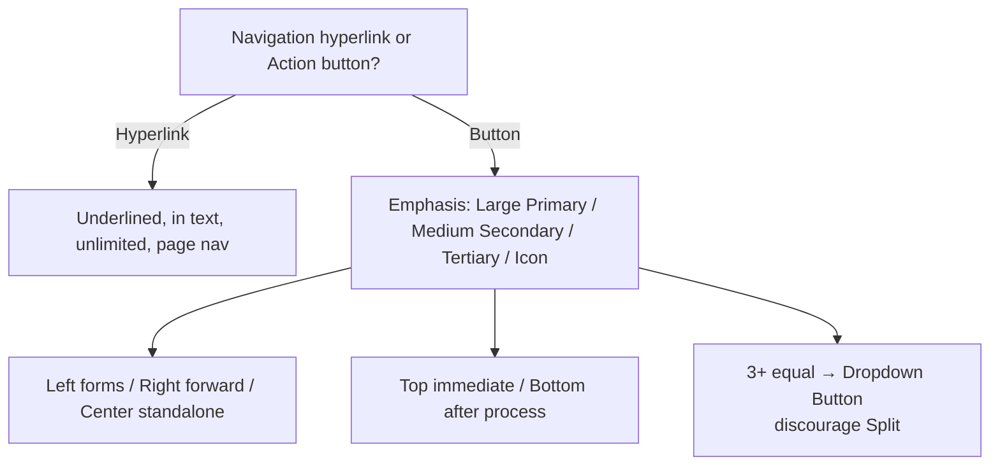

# Calls to Action / Buttons Decision Tree — Workday Canvas (Full)

**Root**: Navigation (hyperlink) or action (button)?

**Button Path**
- Emphasis: Large Primary (standalone high priority), Medium/Secondary (groups), Tertiary (low emphasis in content), Icon Button
- Alignment: Left (forms), Right (forward progress), Center (standalone)
- Placement: Top (immediate), Bottom (after processing)
- Grouping (3+ equal): Dropdown Button (discourage Split)

**Common Labels and Scenario Examples**
- Full source tables for labels, do's/don'ts for button groups, accessibility contrast 4.5:1

**When to Use Hyperlink vs Button**
- Hyperlink: page navigation, in text, unlimited
- Button: state/data change, same-page actions
## Visual Decision Tree (Mermaid)

