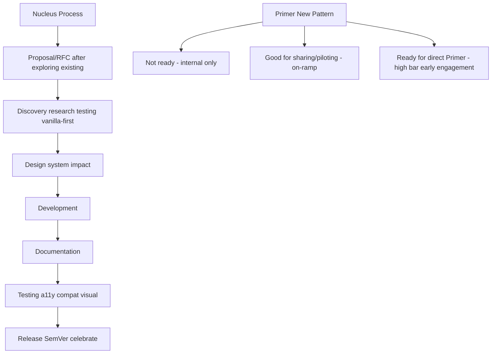

# Design System Contribution / New Pattern Decision Tree — Nucleus + GitHub Primer (Full)

**Nucleus Process (any change)**
1. Proposal/RFC (after exploring existing)
2. Discovery (research, testing, vanilla-first, scope, tickets)
3. Design
4. Development
5. Documentation
6. Testing (a11y, compat, visual, etc.)
7. Release (SemVer, celebrate)

**Primer New Pattern Readiness**
- Not ready (team-specific, rushed, overly complex) → internal only
- Good for sharing/piloting (multi-product, codifies pattern, explainable, no monolith deps) → pilot/on-ramp
- Ready for direct Primer (meets sharing + maintainers agree + timeline) → add (high bar, early engagement)

**Flowchart Reference**: Primer site visual summary
## Visual Decision Tree (Mermaid)

