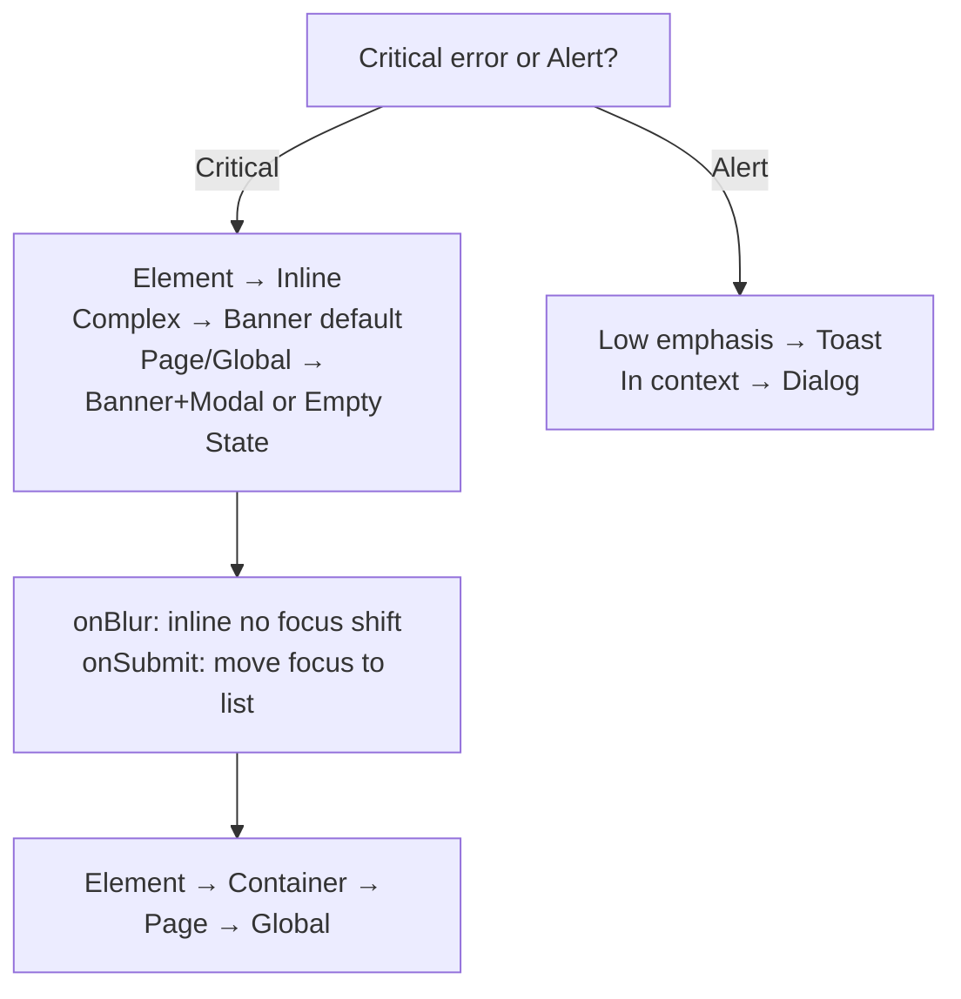

# Errors and Alerts Decision Tree — Workday Canvas (Full)

**Root**: Critical error (must resolve to proceed) or alert (warning)?

**Critical Error Path**
- Element-level → Inline error + label
- Complex/multiple → Banner (default)
- Page-level or global → Banner + Modal or Empty State

**Alert Path**
- Low emphasis → Toast
- In context → Dialog

**Timing Rules**
- onBlur: immediate inline, never auto-shift focus (keyboard trap risk)
- onSubmit: move focus to list

**Full Source Content**
- Message hierarchy (element/container/page/global)
- Error prevention techniques
- Concrete examples table from Workday
- Accessibility: color not sole indicator, focus management, live regions

**Hierarchy**: Element → Container → Page → Global
## Visual Decision Tree (Mermaid)

