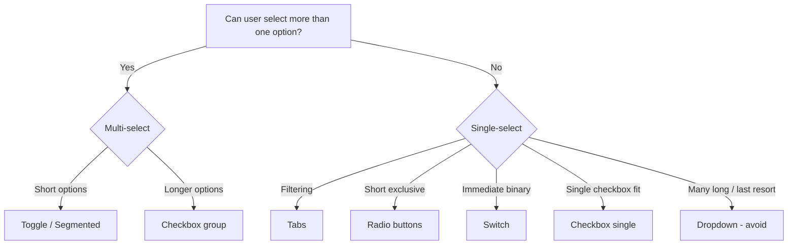

# Form Components Decision Tree — Lyft + Doctolib

**Root Question**: Can the user select more than one option?

**Yes (Multi-select)**
- Short options → Toggles / Segmented Control
- Longer or descriptive options → Checkboxes

**No (Single-select)**
- Filtering or view switching → Tabs
- Short mutually exclusive options → Radio buttons
- Binary, immediate state change → Switch
- Single option with checkbox semantics → Checkbox
- Many long options or last resort → Dropdown (explicitly discouraged as first choice)

**Full Guidance from Sources**
- Lyft: "Dropdown as a method of last resort, with many long options."
- Always consider scanning patterns and form context.
- Doctolib provides visual examples and B2B variants (Oxygen DS).

**When to Use Something Else**
- Use segmented controls for 2–4 short exclusive choices in compact space.
- Never default to dropdown when radio or tabs are viable.

**Accessibility Notes**
- Radio groups must have proper labeling and keyboard navigation.
- Checkboxes and toggles must announce state changes to screen readers.
## Visual Decision Tree (Mermaid)

