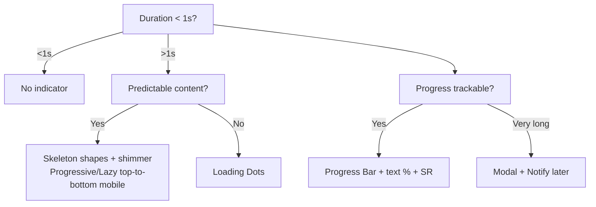

# Loading UX Decision Tree — Workday Canvas (Full)

**Root Questions**
1. Expected duration?
2. Content predictable or variable?
3. Progress trackable?

**< 1s**: No indicator

**> 1s**
- Predictable → Skeleton (shapes + shimmer; progressive/lazy top-to-bottom on mobile)
- Variable → Loading Dots
- Trackable → Progress Bar (with text %, contrast rules, SR announce)
- Very long → Modal with "Notify me later"

**Switch Rules and Full Accessibility**
- SR status announcement always
- Allow motion disable (5s stop)
- Contrast 3:1 graphic / 4.5:1 text
- References: Nielsen Norman response times
## Visual Decision Tree (Mermaid)

