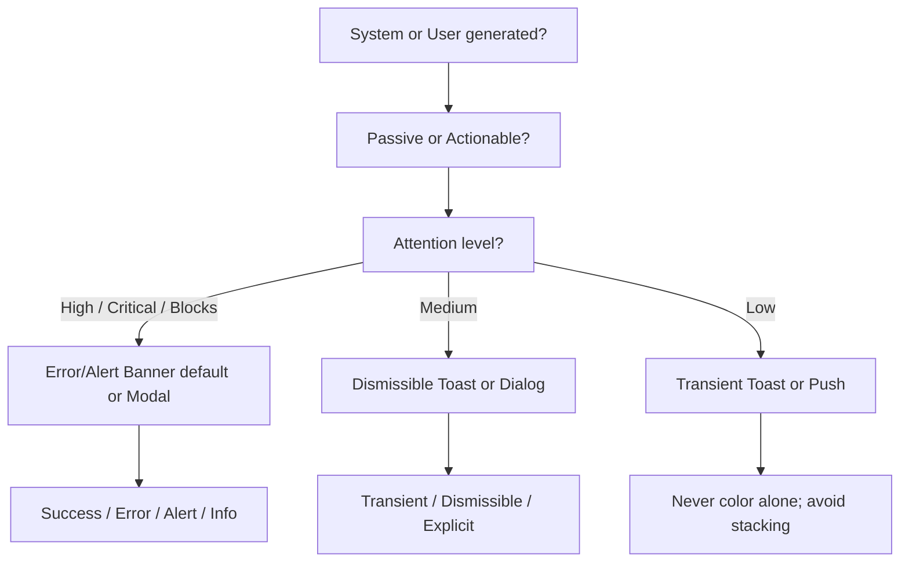

# Notifications Decision Tree — Workday Canvas (Full)

**Root Questions**
1. System-generated or user-generated?
2. Passive or actionable?
3. Attention level required?

**High Attention / Critical / Blocks Progress**
- Page-level or many issues needing navigation → Error/Alert Banner (default)
- Global or not element-tied → Modal (Alert variant)
- Complex form validation on submit → Banner

**Medium Attention**
- Needs explicit dismiss → Dismissible Toast
- Optional / in context → Dialog (non-modal)

**Low Attention**
- Supplemental, no focus shift → Transient Toast
- Mobile timely push → Push Notification

**States**: Success (green), Error (red/cinnamon), Alert (cantaloupe), Info (blue). Never use color alone.

**Behavior**: Transient vs Dismissible vs Not dismissible vs Explicit double-confirm.

**Full Tables and Examples**
(See original Workday archived page for complete message type table, state icons, live region rules, and "When to Use Something Else" guidance.)

**Accessibility**
- Transient toasts missable with magnification.
- Live regions only with intent; plain text only.
- After manual dismiss, restore logical focus.
## Visual Decision Tree (Mermaid)

