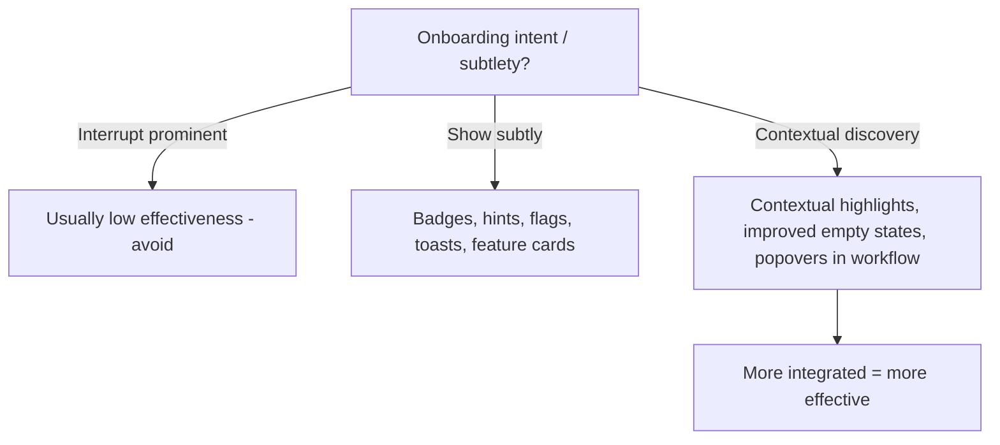

# Onboarding Components Decision Tree — NewsKit

**Root**: Intent / subtlety level?

**Interrupt with details** (prominent, out-of-flow): Usually low effectiveness → avoid or use sparingly

**Show subtly during experience**: Higher effectiveness → badges, hints, flags, toasts, feature cards

**Enable discovery in task context** (integrated): Most effective → contextual highlights, improved empty states, popovers tied to workflow

**Spectrum Rule**: More integrated = more effective. Choose based on acceptable disruption vs discovery goal.

**Toolkit**: Figma community prototype
## Visual Decision Tree (Mermaid)

