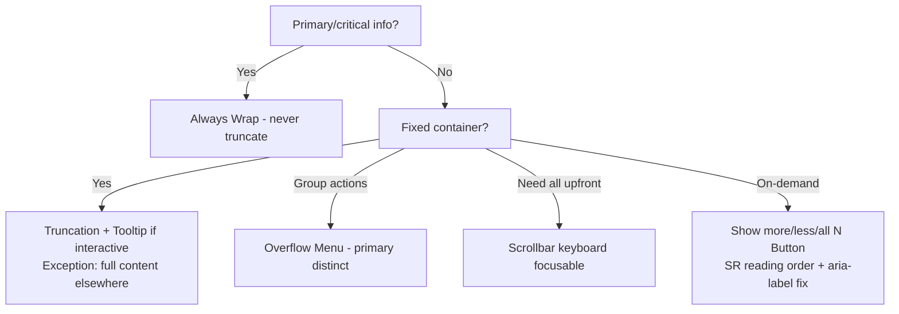

# Truncation / Overflow Decision Tree — Workday Canvas (Full)

**Root Questions**
1. Primary/critical or secondary?
2. Space constrained / fixed container?
3. Text or group of elements?

**Primary/Critical**: Always Wrap (never truncate)

**Secondary**
- Fixed container → Truncation (ellipsis + Tooltip if interactive; unique info first)
- Exception: full content elsewhere → Truncate without Tooltip
- Group of actions → Overflow Menu (primary kept distinct)
- Need all upfront → Scrollbar (keyboard focusable)
- On-demand lower cognitive load → "Show more/less/all N" Button (exact count; SR reading order warning + aria-label fix)

**Global Rules**
- Visual indicator near overflow
- Accessible reveal for all methods
- 200% zoom, longest locale test
- Never truncate Buttons, errors, headings, task-critical text
## Visual Decision Tree (Mermaid)

