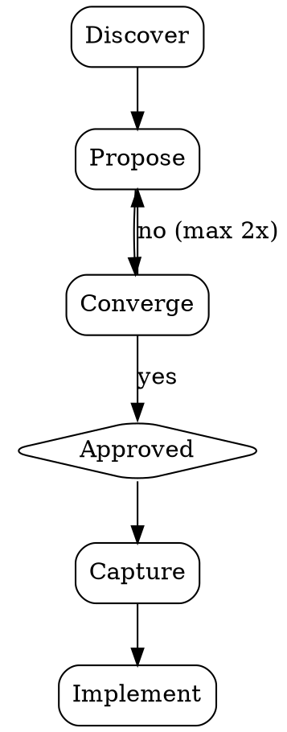

# Simple Brainstorm

A streamlined brainstorm flow for moving from idea to direction quickly. It preserves the parts of collaborative design that matter — exploring intent, weighing trade-offs, getting alignment — while skipping the parts that don't scale to focused work: multi-phase rituals, mandatory design docs, drawn-out clarification rounds.

The goal is simple: understand what the user wants, think through the options together, pick a direction, and start moving. Just enough structure to make good decisions, and no more.

## Ground rules

Do NOT write code, scaffold files, or take implementation action until the user has explicitly approved a direction. The whole point of brainstorming is to pause and think before building — respect that boundary even when the task seems obvious.

## Process flow

- **Discover** — Assess project context (codebase, conventions, existing patterns). Ask up to 3 focused questions in one batch — prefer multiple-choice. If intent is already clear, skip directly to proposing.

- **Propose** — Present 2 approaches with trade-offs. Lead with the recommendation and explain why in one paragraph. Scale detail to the task — a few sentences for simple work, more reasoning for nuanced calls.

- **Converge** — Get explicit user approval. If rejected, revise and re-propose — max 2 rounds. If still misaligned, ask the user to state their preferred direction directly. A good-enough choice made quickly beats a perfect one made slowly.

- **Capture** — Record the chosen direction (what, why, key decisions) as an inline comment in the first file created, or just summarize it in chat. Don't create a separate design doc unless the user asks for one.

## Principles

- **Speed over ceremony** — Value lives in the thinking, not in the artifacts. Skip formality wherever it doesn't pay for itself.
- **YAGNI** — Design only for what's needed right now. Don't add extension points, abstractions, or flexibility for hypothetical future requirements.
- **Bias toward action** — When two options are close, pick one and go. Movement creates clarity faster than deliberation.
- **Batched discovery** — Ask clarifying questions together, not one per message. Drawn-out discovery wastes flow.
- **Proportional depth** — Match process weight to task weight. A config tweak might flow through Discover and Propose in a single message; a new subsystem deserves more space.

## When NOT to use this skill

Reach for a heavier process when:

- The change spans multiple subsystems or independent components — decompose first, then brainstorm each piece separately.
- A formal design document is a downstream requirement (e.g., team review process, ADR-track decision).
- The decision is high-blast-radius and effectively irreversible (production data shape, public API contract, cross-org commitment).

For those, use the heavier `brainstorming` skill or invoke a dedicated design-doc workflow.
