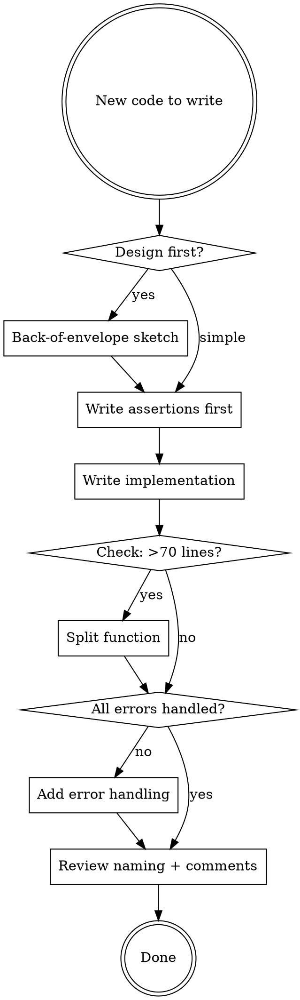

# TigerStyle

Adapted from [TigerBeetle's coding style](https://github.com/tigerbeetle/tigerbeetle/blob/main/docs/TIGER_STYLE.md). Language-agnostic principles for writing safe, performant, maintainable code.

## Design Priority

**Safety > Performance > Developer Experience.** All three matter. This order breaks ties.

## Zero Technical Debt

Do it right the first time. Ship less, but ship solid. What we have meets our design goals. The second chance may never come.

> A problem solved in design is 10x cheaper than in implementation, 100x cheaper than in production.

## Safety Rules (adapted from NASA Power of Ten)

### Control Flow
- **Simple, explicit control flow only.** No recursion (ensures bounded execution). Minimal abstractions — every abstraction risks leaking.
- **Split compound conditions** into nested `if/else`. Each branch handles one case clearly. Ensure positive AND negative space are covered or asserted.
- **State invariants positively.** Prefer `if (index < length)` over `if (!(index >= length))`.

### Bounds
- **Put a limit on everything.** All loops and queues must have fixed upper bounds. Fail fast when limits are exceeded.
- **Bounded loops only.** Where a loop genuinely cannot terminate (event loop), assert that fact explicitly.

### Assertions

Assertions detect **programmer errors** (not operating errors). The only correct response to corrupt logic is to crash. Assertions downgrade catastrophic correctness bugs into liveness bugs.

| Rule | Example |
|------|---------|
| Assert pre/postconditions and invariants | Validate arguments at function entry |
| Minimum 2 assertions per function | Check inputs AND outputs/state |
| Pair assertions — same property, two code paths | Assert before write AND after read |
| Split compound assertions | `assert(a); assert(b);` not `assert(a && b)` |
| Assert positive AND negative space | Check what you expect AND what you don't |
| Assert compile-time constants | Verify relationships between config values |
| Use assertions as documentation | A true assertion > a comment, when the condition is critical |

**Language adaptation:**

```go
// Go: use explicit checks that panic on programmer error
func processBlob(data []byte, maxSize int) {
    if len(data) == 0 { panic("processBlob: data must not be empty") }
    if maxSize <= 0   { panic("processBlob: maxSize must be positive") }
    // ... logic ...
    if result < 0 { panic("processBlob: result must not be negative") }
}
```

```rust
// Rust: debug_assert for dev, assert for invariants that must hold in release
fn process_blob(data: &[u8], max_size: usize) {
    assert!(!data.is_empty(), "data must not be empty");
    assert!(max_size > 0, "max_size must be positive");
    debug_assert!(max_size <= MAX_BLOB_SIZE);
}
```

```typescript
// TypeScript: throw for programmer errors at system boundaries
function processBlob(data: Uint8Array, maxSize: number): void {
    if (data.length === 0) throw new Error("processBlob: data must not be empty");
    if (maxSize <= 0) throw new Error("processBlob: maxSize must be positive");
}
```

### Memory & Resources
- **Allocate at startup, not at runtime** where feasible. Pre-allocate buffers, pools, connection limits. This eliminates use-after-free and unpredictable latency.
- **Smallest possible scope** for all variables. Declare close to use. Don't leave variables around after they're needed.
- **Group allocation and deallocation** visually (blank line before alloc, defer/close immediately after).

### Error Handling
- **All errors must be handled.** 92% of catastrophic distributed system failures stem from incorrect handling of non-fatal errors ([Yuan et al., OSDI '14](https://www.usenix.org/system/files/conference/osdi14/osdi14-paper-yuan.pdf)).
- Handle the error, propagate it, or assert it cannot happen. Never silently ignore.

### Functions
- **Hard limit: 70 lines per function.** If it doesn't fit on a screen, split it.
  - Push `if`s up, `for`s down — centralize control flow in the parent, move pure logic to helpers.
  - Keep leaf functions pure. Parent manages state.
  - Good shape: few params, simple return, meaty logic inside.
- **Simpler return types reduce call-site complexity.** Prefer `void` > `bool` > `value` > `optional` > `error`.
- **Compiler warnings at strictest setting.** Treat warnings as errors.

### External Events
- Don't react directly to external events. Run at your own pace. Batch instead of context-switching per event. This keeps control flow under your control and improves performance.

## Performance Rules

### Design-Phase Thinking
> The best time to solve performance — the 1000x wins — is in design, precisely when you can't measure.

- **Back-of-envelope sketches** for the four resources: network, disk, memory, CPU. Two characteristics each: bandwidth, latency.
- Optimize for **slowest resource first** (network > disk > memory > CPU), adjusted for access frequency.

### Batching
- Amortize costs by batching. Batch network calls, disk I/O, memory access patterns, CPU work.
- Let the CPU sprint: predictable access patterns, large chunks of work, no zig-zagging.

### Control Plane vs Data Plane
- Separate control plane (setup, config, metadata) from data plane (hot path). Assertions and safety checks go in control plane. Data plane is optimized for throughput.

### Be Explicit
- Don't rely on compiler optimizations for correctness. Extract hot loops into standalone functions with primitive arguments so humans can reason about them.

## Developer Experience Rules

### Naming

| Principle | Good | Bad |
|-----------|------|-----|
| Descriptive, no abbreviations | `connection_timeout_ms` | `conn_to` |
| Units/qualifiers last, descending significance | `latency_ms_max` | `max_latency_ms` |
| Related names same length | `source` / `target` | `src` / `dest` |
| Nouns over participles for identifiers | `replica.pipeline` | `replica.preparing` |
| Helper prefixed with caller name | `read_sector_callback` | `on_read_done` |
| Callbacks last in parameter list | `fn read(path, opts, cb)` | `fn read(cb, path, opts)` |

- **Order matters.** Important things at the top. `main` goes first. Struct fields before methods.
- **Don't overload names** across contexts. If a term means something in your domain, don't reuse it for something else in your protocol.

### Comments
- **Always say why.** Code says what and how. Comments say why.
- **Always say how** for tests. Describe goal and methodology at the top.
- Comments are sentences: capital letter, full stop. End-of-line comments can be phrases.

### Variables & State
- **Don't duplicate state.** No aliases that can go stale.
- **Calculate close to use.** Minimize the gap between place-of-check and place-of-use (POCPOU).
- **Index vs Count vs Size are distinct types.** Index is 0-based, Count is 1-based, Size = Count × unit. Name them accordingly.

### Division Intent
- Show rounding intent explicitly: exact division, floor division, or ceiling division. Don't leave it ambiguous.

### Dependencies
- **Minimize dependencies.** Every dependency is a supply chain risk, a performance risk, and a maintenance burden. For infrastructure code, prefer zero external dependencies beyond the language toolchain.
- **Explicitly pass options** to library calls. Don't rely on defaults that may change.

### Formatting
- Use your language's canonical formatter (`gofmt`, `rustfmt`, `prettier`, `black`).
- Hard limit line length to **100 columns**. No exceptions.
- **4 spaces** indentation (or language convention if strongly established).
- Always use braces on `if` statements (defense against "goto fail" bugs).

### Commit Messages
- **Descriptive commit messages** that inform and delight. PR descriptions are invisible in `git blame` — the commit message IS the documentation.

## Quick Reference: Applying TigerStyle to Your Project



## Adapting to Your Language

| TigerStyle Rule | Go | Rust | TypeScript | Python |
|---|---|---|---|---|
| Assertions | `if cond { panic() }` | `assert!` / `debug_assert!` | `throw new Error()` | `assert` / `raise` |
| Explicit types | Native (strongly typed) | Native | Strict TypeScript | Type hints + mypy |
| Static allocation | Pre-sized slices, sync.Pool | Vec::with_capacity, arena | Pre-allocated buffers | Pre-sized lists, `__slots__` |
| Formatter | `gofmt` | `rustfmt` | `prettier` | `black` / `ruff` |
| Compiler strictness | `go vet`, `staticcheck` | `clippy`, deny warnings | `strict: true`, `noUncheckedIndexedAccess` | `mypy --strict`, `ruff` |
| Error handling | Check every `err` | `?` operator, no unwrap in prod | Try/catch at boundaries | Explicit exception handling |
| No recursion | Iterative with stack | Iterative with stack | Iterative with stack | Iterative with stack |

## Common Mistakes

| Mistake | TigerStyle Fix |
|---------|---------------|
| "I'll add assertions later" | Assertions FIRST. They define the contract. |
| "This function is complex but it works" | If it exceeds 70 lines, split it. Art is born of constraints. |
| "We can refactor later" | Zero technical debt. Do it right now. |
| "The error can't happen here" | Assert it can't. If you're wrong, you'll know immediately. |
| "Performance can be optimized later" | Design for performance. The 1000x wins are in design, not profiling. |
| "The variable name is obvious in context" | It won't be obvious in 6 months. Be descriptive. Add units. |
| "Let's add this dependency, it saves time" | Every dependency is a liability. Can you write the 50 lines yourself? |

## The Essence

> "Simplicity and elegance are unpopular because they require hard work and discipline to achieve." — Dijkstra

Simplicity is not the first attempt. It's the hardest revision. Spend the mental energy upfront — an hour of design is worth weeks in production.
